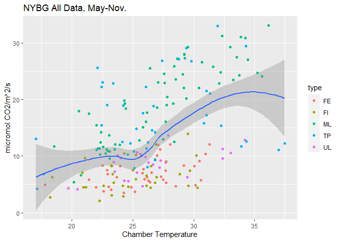
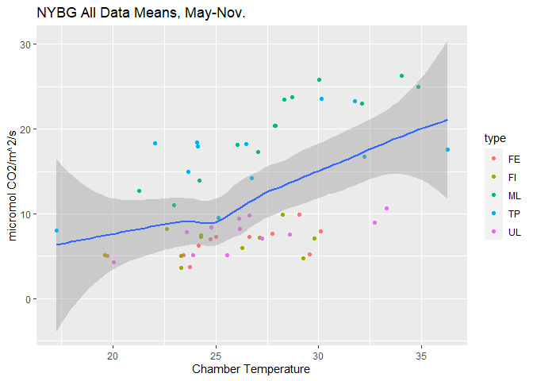

### Chamber Temperature v. CO2



### Soil Temperature v. CO2


### Soil Temperature v. Respiration by Collar Type


### Chamber Temperature v. Respiration by Collar Type


### Chamber Temperature by Collar Type


### Soil Temperature by Collar Type


### Respiration by Collar Type


### Scatterplot Matrix - correlations between all variables


### Comparison of NDVI Measurements


### Fitting multiple regression models

Model 1. Linear Model: respiration = b0 + chamber temperature + ndvi

    ## 
    ## Call:
    ## lm(formula = mean_res ~ mean_temp + mean_ndvi, data = df.m)
    ## 
    ## Residuals:
    ##      48      50      53      55      58      60 
    ## -0.1775  2.0054  1.6426 -1.6170 -0.4984 -1.3552 
    ## 
    ## Coefficients:
    ##             Estimate Std. Error t value Pr(>|t|)  
    ## (Intercept) -34.3084    15.4802  -2.216   0.1134  
    ## mean_temp     0.8153     0.6967   1.170   0.3264  
    ## mean_ndvi    35.0849     7.1558   4.903   0.0162 *
    ## ---
    ## Signif. codes:  0 '***' 0.001 '**' 0.01 '*' 0.05 '.' 0.1 ' ' 1
    ## 
    ## Residual standard error: 1.954 on 3 degrees of freedom
    ##   (59 observations deleted due to missingness)
    ## Multiple R-squared:  0.9437, Adjusted R-squared:  0.9062 
    ## F-statistic: 25.15 on 2 and 3 DF,  p-value: 0.01335

Model 2. Linear model: respiration = b0 + soil temperature + ndvi

``` r
mod2 <- lm(mean_res ~ mean_soil + mean_ndvi,df.m)
summary(mod2) # r2 = .964, mean_soil p = .06
```

    ## 
    ## Call:
    ## lm(formula = mean_res ~ mean_soil + mean_ndvi, data = df.m)
    ## 
    ## Residuals:
    ##      48      50      53      55      58      60 
    ##  0.8049  0.2349  0.4425 -1.6054 -0.6063  0.7295 
    ## 
    ## Coefficients:
    ##             Estimate Std. Error t value Pr(>|t|)  
    ## (Intercept) -33.6431     6.3295  -5.315   0.0130 *
    ## mean_soil     1.1259     0.3877   2.904   0.0623 .
    ## mean_ndvi    27.5836     5.5788   4.944   0.0159 *
    ## ---
    ## Signif. codes:  0 '***' 0.001 '**' 0.01 '*' 0.05 '.' 0.1 ' ' 1
    ## 
    ## Residual standard error: 1.208 on 3 degrees of freedom
    ##   (59 observations deleted due to missingness)
    ## Multiple R-squared:  0.9785, Adjusted R-squared:  0.9642 
    ## F-statistic: 68.25 on 2 and 3 DF,  p-value: 0.003154

Model 3. Log transformation: respiration = b0 + log(soil temp) +
log(ndvi)

``` r
mod3 <- lm(mean_res ~ I(log(mean_soil)) + I(log(mean_ndvi)),df.m)
summary(mod3) # r2 = .943, mean_soil p = .08
```

    ## 
    ## Call:
    ## lm(formula = mean_res ~ I(log(mean_soil)) + I(log(mean_ndvi)), 
    ##     data = df.m)
    ## 
    ## Residuals:
    ##      48      50      53      55      58      60 
    ##  0.8929  0.2807  0.6610 -2.1449 -0.5508  0.8611 
    ## 
    ## Coefficients:
    ##                   Estimate Std. Error t value Pr(>|t|)  
    ## (Intercept)        -69.508     35.830  -1.940   0.1477  
    ## I(log(mean_soil))   28.047     11.052   2.538   0.0848 .
    ## I(log(mean_ndvi))   17.809      4.689   3.798   0.0320 *
    ## ---
    ## Signif. codes:  0 '***' 0.001 '**' 0.01 '*' 0.05 '.' 0.1 ' ' 1
    ## 
    ## Residual standard error: 1.523 on 3 degrees of freedom
    ##   (59 observations deleted due to missingness)
    ## Multiple R-squared:  0.9658, Adjusted R-squared:  0.943 
    ## F-statistic: 42.36 on 2 and 3 DF,  p-value: 0.006324

Model 4. Exponential model: respiration = b0 + exp(soil temperature +
ndvi)

``` r
mod4 <- lm(log(mean_res) ~ mean_soil + mean_ndvi,df.m) # significant!!
summary(mod4) # r2 = .996, variables p < .00
```

    ## 
    ## Call:
    ## lm(formula = log(mean_res) ~ mean_soil + mean_ndvi, data = df.m)
    ## 
    ## Residuals:
    ##        48        50        53        55        58        60 
    ##  0.046532  0.016384 -0.027887  0.005516 -0.017125 -0.023420 
    ## 
    ## Coefficients:
    ##             Estimate Std. Error t value Pr(>|t|)    
    ## (Intercept) -1.50284    0.19336  -7.772 0.004431 ** 
    ## mean_soil    0.07064    0.01184   5.965 0.009427 ** 
    ## mean_ndvi    3.09975    0.17042  18.188 0.000363 ***
    ## ---
    ## Signif. codes:  0 '***' 0.001 '**' 0.01 '*' 0.05 '.' 0.1 ' ' 1
    ## 
    ## Residual standard error: 0.03689 on 3 degrees of freedom
    ##   (59 observations deleted due to missingness)
    ## Multiple R-squared:  0.9977, Adjusted R-squared:  0.9962 
    ## F-statistic: 661.9 on 2 and 3 DF,  p-value: 0.0001075

### Plot residuals for Model 4


### Measured vs. Predicted seasonal mean respiration using Model 4

    ## [1] 77.68698


    ## [1] 86.2923


### Measured vs. Predicted seasonal median respiration using Model 4

    ## [1] 102.817


    ## [1] 116.9311


